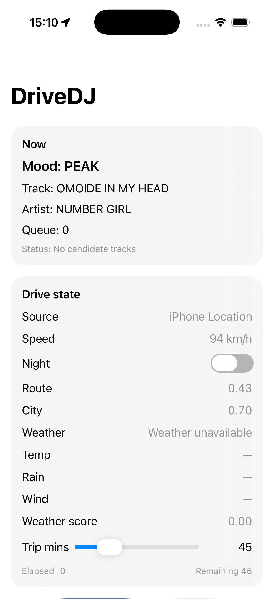
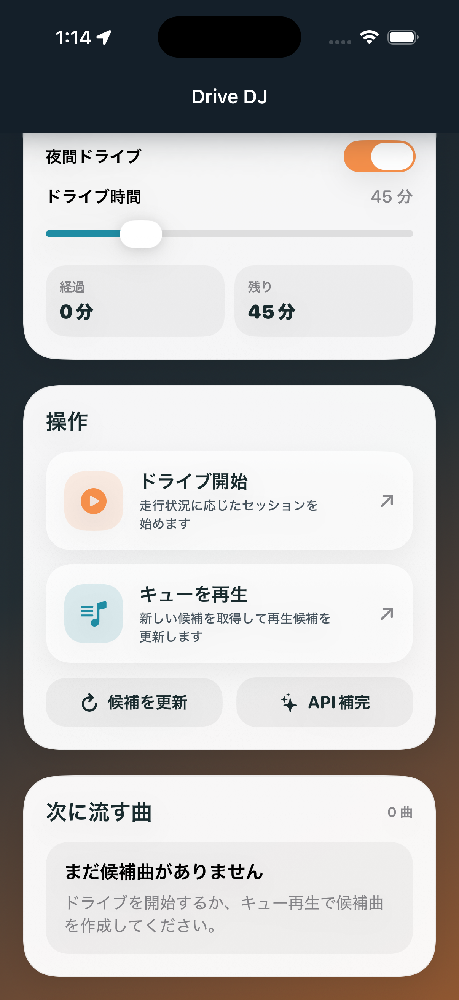

# DriveDJ

DriveDJ は、走行状況に応じて曲のテンションを切り替える iOS / CarPlay 向けの実験アプリです。現在のコードでは、位置情報・速度・時間帯・簡易的な街中判定・WeatherKit の天候情報を使って `DriveMood` を決め、Cyanite で候補曲を探し、Apple Music の楽曲に解決して表示します。

現在の iPhone UI は、日本語表示のダッシュボード型レイアウトです。上部にヒーローカード、その下にドライブ状態、操作、次に流す曲、解決ログが並び、運転コンテキストと候補キューを 1 画面で確認できます。

## 現在の実装範囲

現時点で動いている主な流れは以下です。

1. `DriveSessionManager` が位置情報を監視し、速度、夜間フラグ、ルート強度、街中密度、天候スコアを更新する。
2. `MoodEngine` が `DriveState` から `CHILL / MID / UP / PEAK / END` のムードを判定する。
3. `CyaniteService` がムードとテンポ・エネルギー条件から候補曲を検索する。
4. `AppleMusicResolver` が候補曲名を Apple Music の `Song` に解決する。
5. `DriveDJViewModel` が SwiftUI 画面と CarPlay 画面に状態を反映する。

補足です。

- iPhone 側のメイン画面は `ContentView` です。
- CarPlay 側は `CarPlaySceneDelegate` の `CPListTemplate` で簡易表示しています。
- `キューを再生` ボタンは候補曲の再取得と状態更新の起点です。
- `候補を更新` は現在の走行状態から候補を引き直します。
- `API補完` は UI 上にはありますが、現状はプレースホルダーです。
- Spotify 関連クラスは残っていますが、現在の主導線は Cyanite + Apple Music です。

## 画面イメージ

スクリーンショットは `docs/screenshots/` に置く前提です。以下のファイル名で保存すると、そのまま README に表示されます。

### iPhone

`docs/screenshots/iphone-main.png`

<!-- ### CarPlay

`docs/screenshots/carplay-main.png`

 -->

まだ画像がない場合は、上のファイル名で保存するだけで差し替わります。管理ルールは [docs/screenshots/README.md](/Users/user/DriveDJ/docs/screenshots/README.md) にまとめています。

## UI で確認できる内容

`ContentView` では次の情報を確認できます。

- `ドライブに合わせて選曲`: 現在のムード、ステータス、現在曲、再生元、キュー件数
- `ドライブ状態`: ルート強度、街中密度、気温、天候スコア、降水量、風速、夜間ドライブ設定
- `ドライブ時間`: 想定ドライブ時間のスライダー
- `経過 / 残り`: 経過時間と残り時間
- `操作`: `ドライブ開始 / ドライブ終了`、`キューを再生`、`候補を更新`
- `次に流す曲`: 次に提案される楽曲一覧
- `解決ログ`: Cyanite / Apple Music 解決の途中経過

`ドライブ開始` を押すと `DriveSessionManager` のタイマーと位置情報更新が動き、CarPlay 接続時は `setCarPlayConnected(true)` 経由で同様の流れに入ります。

## アーキテクチャ

主要ファイルの役割は以下です。

- `DriveDJApp.swift`: アプリ起点
- `ContentView.swift`: iPhone 画面
- `DriveDJViewModel.swift`: 画面状態の管理
- `DriveSessionManager.swift`: 位置情報、走行状態、天候状態の集約
- `MoodEngine.swift`: 走行状態からムードを算出
- `DriveDJOrchestrator.swift`: 推薦と再生導線のオーケストレーション
- `LibraryStore.swift`: 候補曲の読み出しと簡易キャッシュ
- `CyaniteService.swift`: Cyanite GraphQL API 呼び出し
- `AppleMusicResolver.swift`: 候補曲を Apple Music カタログへ解決
- `AppleMusicPlaybackService.swift`: Apple Music 再生補助
- `CarPlaySceneDelegate.swift`: CarPlay 画面

状態モデルは `Models.swift` にまとまっています。

- `DriveState`: ムード判定に使う運転コンテキスト
- `DriveMood`: `CHILL / MID / UP / PEAK / END`
- `PlaybackSnapshot`: 画面表示用の簡易状態
- `TrackRecord`: UI 表示向けの曲情報

## ムード判定ロジック

`MoodEngine` は次の要素を合算してムードを決めます。

- 速度
- ルート強度
- 街中密度
- 天候の厳しさ
- 夜間かどうか
- 残り時間が 8 分以下なら `END`

ざっくりした傾向は以下です。

- 低速で穏やかな状況: `CHILL`
- 普段の街乗り: `MID`
- 流れが良く、少し上がる状況: `UP`
- 高速域や刺激が強い状況: `PEAK`
- 到着間際: `END`

## 推薦フロー

現在の推薦処理は次の構成です。

1. `DriveSessionManager.targetParams(for:)` がムードごとの目標 `energy` と `tempo` を決める。
2. `CyaniteService.fetchCandidates(...)` が自然文検索で候補を取得する。
3. `AppleMusicResolver.resolveSong(from:)` が Apple Music の `Song` に変換する。
4. `DriveDJOrchestrator.nextSetlist(...)` が `TrackRecord` に整形して ViewModel に返す。

実装上の注意です。

- `LibraryStore.load(...)` は毎回複数候補を取得し、既存キャッシュの前に積みます。
- デフォルト seed artist は `DriveSessionManager.fetchNextTrack(...)` 内で Oasis に固定されています。
- Cyanite の decade / style は現在 `1990s` と `rock` 寄りに固定されています。

重複回避のため、現在は以下を入れています。

- Cyanite の取得件数を増やして母数を広げる
- Cyanite 候補をタイトル単位で重複除去する
- ランダム offset で候補の先頭位置を毎回ずらす
- 直近に使った Cyanite 候補タイトルを履歴から除外する
- Apple Music 検索件数を増やし、完全一致タイトルを優先して解決する
- `upcomingTracks`、現在曲、直近解決済み楽曲と被る Apple Music 曲を除外する
- 解決後は `Song.id + title + artist` 単位でユニーク化する
- 候補が足りない場合は複数パスで再取得して埋める

### 重複回避の詳細

重複を避ける処理は 1 箇所ではなく、複数段で入っています。流れとしては次の順です。

1. `DriveDJOrchestrator.fetchRecommendations(...)` が、まず現在の `upcomingTracks` と `currentTrack` から除外対象のタイトル一覧を作る。
2. このタイトル一覧を `CyaniteService.fetchCandidates(...)` に渡し、Cyanite 側の候補取得時点で最近使ったタイトルや現在キューにあるタイトルを落とす。
3. `CyaniteService` では `desiredCount` より多めに候補を取得し、タイトルの正規化比較で重複候補を削る。
4. その上でランダム `offset` を使って候補の先頭位置をずらし、毎回同じ並び順から取り始めないようにする。
5. `DriveDJOrchestrator` 側では、Cyanite 候補を 1 件ずつ Apple Music の `Song` に解決する。
6. Apple Music に解決した後は、`Song.id + title + artist` で作ったキーを使って重複判定する。
7. ここで比較している対象は、現在の `upcomingTracks`、現在曲、直近に採用した曲の履歴 `recentSongKeys` を合わせた集合。
8. まだ必要曲数に足りなければ、Cyanite を最大 3 パス取り直して、同じルールで追加候補を埋める。
9. 最後に採用した `Song` は `rememberSongs(...)` で履歴に保存し、次回以降の選曲で除外対象になる。

コード上で見ると、責務は次のように分かれています。

- `CyaniteService.fetchCandidates(...)`
  - 候補件数の拡大
  - タイトル単位の重複除去
  - ランダム offset
  - 直近候補タイトルの除外
- `AppleMusicResolver.resolveSong(from:)`
  - Apple Music 検索件数を 25 件まで増やす
  - 完全一致タイトルを優先
  - それが無ければ部分一致タイトルを優先
- `DriveDJOrchestrator.fetchRecommendations(...)`
  - 現在曲と upcoming の除外
  - `Song.id + title + artist` ベースの最終重複判定
  - 複数パス再取得
  - 直近採用履歴の保存
- `LibraryStore.load(...)`
  - 新しく取れた曲とキャッシュをマージしつつ、同じ `Song.id + title + artist` キーで再度ユニーク化

実装上のポイントです。

- `title + artist` だけだと別バージョンや解決先の揺れを拾い切れないため、現在は `Song.id` もキーに入れています。
- それでも完全に 0% の重複を保証するわけではありません。理由は、Cyanite の候補タイトルと Apple Music の解決結果が毎回完全に一対一とは限らないためです。
- ただし、現状では「候補取得前」「候補取得後」「Apple Music 解決後」「キャッシュ保存時」の 4 段で重複除外しているため、単純なランダム選曲よりはかなり重複しにくい構成になっています。

## 必要な権限と機能

このアプリを動かすには、少なくとも以下が必要です。

- Location When In Use
- Apple Music 利用許可
- Background Audio
- WeatherKit capability
- CarPlay Audio App に必要な entitlement と scene 設定

現在の `Info.plist` には次の設定が入っています。

- `CFBundleURLSchemes`: `drivedj`
- `SPOTIFY_CLIENT_ID`
- `SPOTIFY_CLIENT_SECRET`
- `SPOTIFY_REDIRECT_URI`
- `CYANETE_API_TOKEN`
- `UIBackgroundModes = audio`
- CarPlay scene (`CPTemplateApplicationScene`)
- `NSLocationWhenInUseUsageDescription`
- `LSApplicationQueriesSchemes = spotify`

補助メモは [DriveDJ/DriveDJ/InfoPlist.sample.txt](/Users/user/DriveDJ/DriveDJ/InfoPlist.sample.txt) と [DriveDJ/DriveDJ/PackageNotes.md](/Users/user/DriveDJ/DriveDJ/PackageNotes.md) にあります。

## セットアップ

### 1. Xcode で開く

通常どおり `DriveDJ.xcodeproj` を開いて署名設定を行ってください。

### 2. Build Settings / xcconfig

`Info.plist` は build setting 展開を使っているので、少なくとも以下の値を供給する必要があります。

- `SPOTIFY_CLIENT_ID`
- `SPOTIFY_CLIENT_SECRET`
- `CYANETE_API_TOKEN`

現在は [DriveDJ/Config/Debug.xcconfig](/Users/user/DriveDJ/Config/Debug.xcconfig) に定義があります。実運用では、認証情報をコミット済みファイルに直書きしない構成へ移すことを強く推奨します。

### 3. Signing & Capabilities

Xcode で以下を有効にしてください。

- WeatherKit
- Background Modes > Audio, AirPlay, and Picture in Picture
- 必要に応じて CarPlay entitlement

### 4. 実機で権限を許可する

初回起動時に以下の許可が必要です。

- 位置情報
- Apple Music

## 使い方

1. アプリを起動する。
2. `ドライブ開始` を押してドライブセッションを開始する。
3. 数秒から十数秒ほど待って、位置情報と天候情報を反映させる。
4. `ドライブ状態` と上部カードで現在の運転コンテキストを確認する。
5. `候補を更新` を押すと現在状態で候補を引き直せる。
6. `キューを再生` を押すと重複を避けながら候補取得と状態更新を走らせる。

CarPlay 接続時は、CarPlay 画面に `ムード`、`再生中`、`状態` が一覧表示されます。

## 現状の制約

README は今のコードに合わせています。したがって、以下は既知の制約として理解してください。

- Spotify 再生系はコードが残っているものの、UI の主導線としては完成していません。
- `API補完` は押しても現状何もしません。
- `LibraryStore` は一般的なライブラリ管理ではなく、推薦結果の短期キャッシュに近い実装です。
- CarPlay 画面は一覧テンプレートのみで、操作導線は最小限です。
- `DriveDJViewModel.debugText` や `print` が多く、開発途中のデバッグ出力が残っています。

## スクリーンショットの追加方法

1. `docs/screenshots/iphone-main.png` に iPhone 画面のスクリーンショットを保存する。
2. `docs/screenshots/carplay-main.png` に CarPlay 画面のスクリーンショットを保存する。
3. 別画面を追加したい場合は README に `` を追記する。

PNG 以外を使いたい場合も Markdown のパスを書き換えるだけです。

## 今後 README と実装を合わせて更新したいポイント

- Apple Music 再生導線を UI から実際に呼ぶ
- Spotify 系導線を残すか削るか整理する
- セットリストを複数曲前提に組み立てる
- CarPlay 画面から再取得や再生操作を行えるようにする
- API キー管理を安全な方法へ移す
